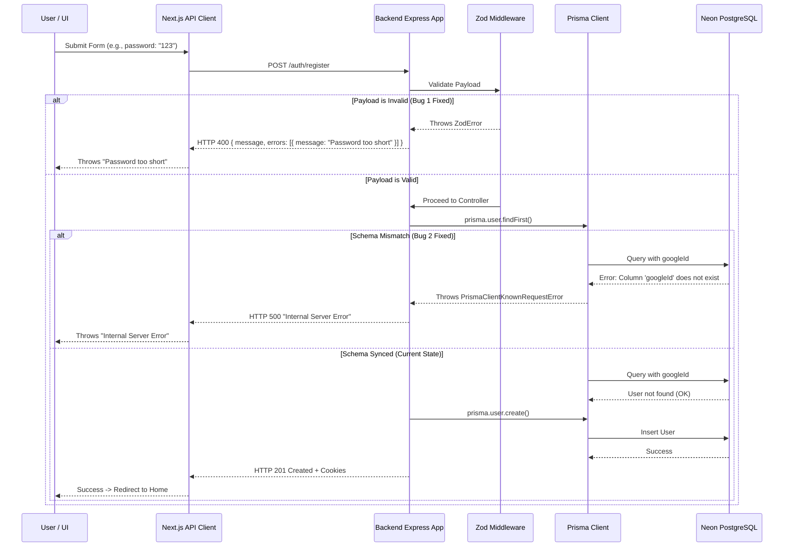

# Authentication Bug Fixes: Post-Mortem & Architecture Updates

This document outlines the two critical bugs identified and resolved during the testing of the authentication (Registration) flow in DevForge.

## Bug 1: Unhandled Validation Errors (HTTP 400 -> "API request failed")

### The Problem
When a user submitted an invalid registration payload (e.g., a password shorter than 8 characters), the `zod` validation middleware caught the error. However, the middleware only returned an `errors` array and omitted a top-level `message` string. The frontend's `api-client.ts` strictly looked for `errorData.message`. Because it was undefined, the frontend threw a generic `"API request failed"` Error, hiding the true validation context from the user interface.

### The Fix
1. **Backend**: Updated `validate.middleware.ts` to include a generic `message: 'Validation failed'` alongside the granular `errors` array mapping.
2. **Frontend**: Updated `api-client.ts` to explicitly check for the `errors` array, map over the specific `zod` constraints, and concatenate them into a human-readable string (e.g., `"Password must be at least 8 characters"`), injecting it directly into the thrown Error.

## Bug 2: Database Schema Mismatch (HTTP 500 -> "Internal Server Error")

### The Problem
During Phase 2, `googleId` and `githubId` fields were added to the `User` model in `schema.prisma`. However, these changes were never synchronized with the hosted Neon PostgreSQL database. When the backend `auth.controller.ts` attempted to run `prisma.user.findFirst()` during registration, the Prisma Client recognized that the underlying SQL table was missing the `googleId` column and subsequently crashed with `Can't reach database server at base`.

### The Fix
Ran `npx prisma db push --accept-data-loss` to forcefully synchronize the local Prisma schema state with the remote Neon database. The SQL table schema was updated to match the application code, preventing the crash.

---

## Error Handling Flow (Mermaid Diagram)

The following diagram illustrates the updated error-handling flow for Authentication:

