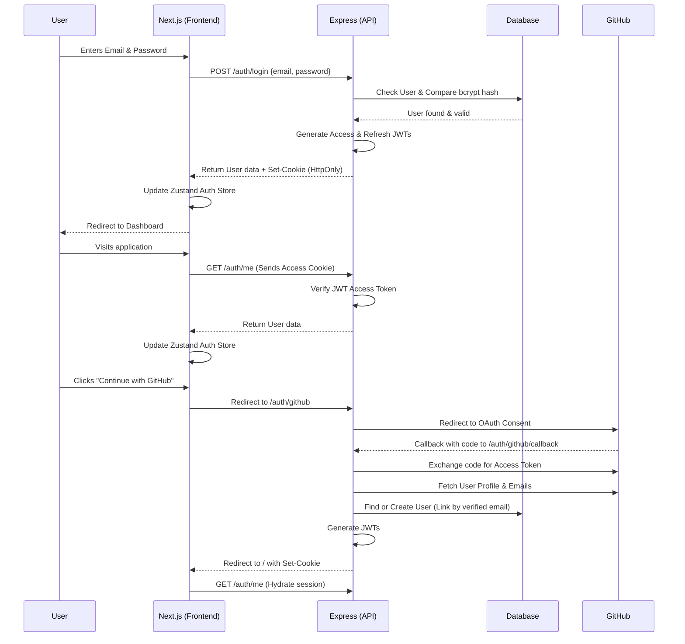

# Phase 2 Authentication Implementation Walkthrough

The Authentication layer for DevForge is now implemented, connecting the Next.js frontend with the newly scaffolded Express backend. The implementation uses HttpOnly cookies, JWTs, and supports native Email/Password, GitHub OAuth, and Google OAuth out of the box.

## Folder Structure

The authentication logic is primarily divided between `apps/api` (backend) and `apps/web` (frontend).

```text
devForge/
├── apps/
│   ├── api/
│   │   ├── src/
│   │   │   ├── controllers/
│   │   │   │   ├── auth.controller.ts     # Local auth logic (login, register, me, refresh)
│   │   │   │   └── oauth.controller.ts    # Manual OAuth logic (GitHub, Google)
│   │   │   ├── middleware/
│   │   │   │   ├── auth.middleware.ts     # JWT verification
│   │   │   │   └── validate.middleware.ts # Zod validation middleware
│   │   │   ├── routes/
│   │   │   │   └── auth.routes.ts         # Express route mappings
│   │   │   ├── schemas/
│   │   │   │   └── auth.schemas.ts        # Zod validation schemas
│   │   │   ├── utils/
│   │   │   │   └── jwt.utils.ts           # Token generation and verification
│   │   │   └── index.ts                   # Express application entry point
│   │   ├── package.json
│   │   └── tsconfig.json
│   │
│   └── web/
│       ├── src/
│       │   ├── app/
│       │   │   └── (auth)/
│       │   │       ├── login/page.tsx     # Login view with OAuth buttons
│       │   │       └── register/page.tsx  # Register view with OAuth buttons
│       │   ├── components/
│       │   │   └── ui/                    # Shadcn UI components
│       │   ├── lib/
│       │   │   └── api-client.ts          # Native fetch wrapper with credentials
│       │   └── stores/
│       │       └── auth.store.ts          # Zustand authentication store
│       └── package.json
│
└── packages/
    └── db/
        ├── prisma/
        │   └── schema.prisma              # Updated User model (added googleId, tokenVersion)
        ├── src/
        │   └── index.ts                   # Global PrismaClient export
        └── package.json                   # Updated entry points
```

## Authentication Flow Diagram



## API Routes Implemented

All routes are prefixed with `/auth` in the API.

| Method | Endpoint               | Description                                           | Payload / Query         |
| :---   | :---                   | :---                                                  | :---                    |
| `POST` | `/register`            | Create new account via email/password.                 | `email`, `username`, `password` |
| `POST` | `/login`               | Authenticate via email/password.                       | `email`, `password`     |
| `POST` | `/logout`              | Clears `HttpOnly` cookies.                             | -                       |
| `GET`  | `/me`                  | Returns current logged-in user details.                | *Requires Auth Cookie*  |
| `POST` | `/refresh`             | Issues new access token if refresh token is valid.     | *Requires Refresh Cookie* |
| `GET`  | `/github`              | Redirects to GitHub OAuth consent screen.              | -                       |
| `GET`  | `/github/callback`     | Handles GitHub OAuth callback and user provisioning.   | `code`                  |
| `GET`  | `/google`              | Redirects to Google OAuth consent screen.              | -                       |
| `GET`  | `/google/callback`     | Handles Google OAuth callback and user provisioning.   | `code`                  |

## Environment Variables Required

You must add the following variables to your root `.env` file before starting development.

> [!WARNING]  
> You need to generate OAuth credentials in both GitHub (Developer Settings > OAuth Apps) and Google Cloud Console.

```env
# Application URLs
FRONTEND_URL=http://localhost:3000
BACKEND_URL=http://localhost:5000
API_PORT=5000

# JWT Secrets (Generate random strings for production)
JWT_SECRET=super_secret_access_key_dev
REFRESH_TOKEN_SECRET=super_secret_refresh_key_dev

# GitHub OAuth Credentials
# Callback URL in GitHub: http://localhost:5000/auth/github/callback
GITHUB_CLIENT_ID=your_github_client_id
GITHUB_CLIENT_SECRET=your_github_client_secret

# Google OAuth Credentials
# Callback URL in Google: http://localhost:5000/auth/google/callback
GOOGLE_CLIENT_ID=your_google_client_id
GOOGLE_CLIENT_SECRET=your_google_client_secret
```
