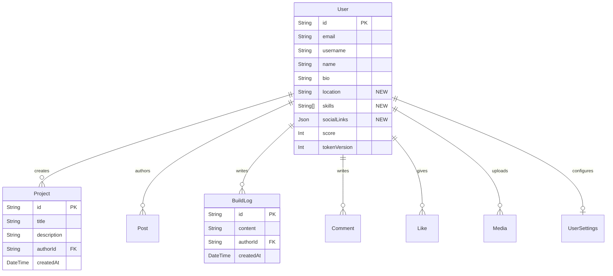

# Phase 3 Developer Profiles Walkthrough

The Developer Profiles layer for DevForge is now implemented, providing developers with a centralized hub to showcase their identity, skills, and activity on the platform.

## Database Schema Updates

We have expanded the `User` model to accommodate developer profiles, adding three key fields while maintaining a clean, single-table design for the core user identity:
- `location` (String)
- `skills` (Array of Strings)
- `socialLinks` (JSON object holding GitHub, Twitter, LinkedIn, and website URLs)

### Relationship Diagram

## Backend APIs Implemented (`apps/api/src/routes/user.routes.ts`)

All routes are prefixed with `/users` in the Express API.

| Method | Endpoint               | Description                                           | Payload / Query         |
| :---   | :---                   | :---                                                  | :---                    |
| `GET`  | `/`                    | Lists developers, paginated and sorted by score.      | `?page=1&limit=20`      |
| `GET`  | `/:username`           | Fetches a public profile and recent activity.         | -                       |
| `PUT`  | `/profile`             | Updates the authenticated user's profile data.        | `{ name, bio, location, skills, socialLinks }` |

The `PUT /users/profile` route is protected by the `requireAuth` middleware and strictly validated using Zod schemas to ensure `socialLinks` contain valid URLs and `skills` don't exceed array limits.

## Frontend Views Created (`apps/web`)

### 1. Public Profile Page (`/u/[username]`)
A responsive, server-rendered Next.js page (`apps/web/src/app/u/[username]/page.tsx`) that fetches data from the API and displays:
- **Left Sidebar**: User's Avatar, Name, Username, Bio, Location, Skills tags, and Contribution Score.
- **Main Area**: A dynamic `<ActivityFeed />` component that merges the user's `projects` and `buildLogs` into a unified, chronological timeline.

### 2. Edit Profile Settings (`/settings/profile`)
A comprehensive, client-side form (`apps/web/src/app/settings/profile/page.tsx`) for authenticated users.
- Built natively using standard HTML inputs combined with `react-hook-form` and `@hookform/resolvers/zod`.
- Validates URLs and string lengths matching the backend restrictions.
- Automatically hydrates with the user's existing data upon load by checking the global Zustand `auth.store.ts`.
- Updates the UI and global state seamlessly upon a successful save.

## Technical Improvements
During this phase, we also enhanced the strictness of our TypeScript configuration:
1. Updated `packages/db` to compile directly to `dist/index.js` and `dist/index.d.ts` using `tsc`, eliminating implicit runtime module resolution hacks.
2. Configured `apps/api` to enforce strict `.js` imports and correctly consume the built database types.
