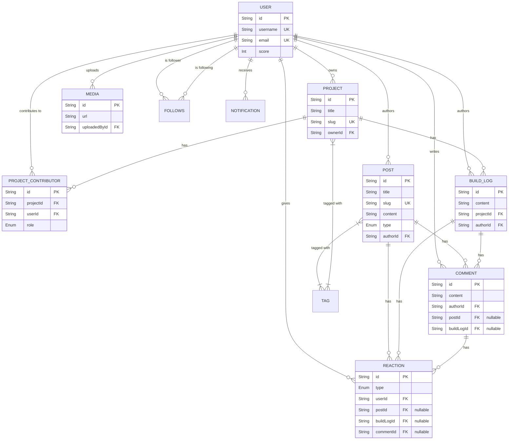

# DevForge: Database Design Document (V1)

## 1. Complete Domain Model

The domain model is structured to support the core value proposition of Developer Identity, Portfolio (Projects), "Build in Public" (Build Logs), and Community (Posts, Feed).

1. **Identity & Social Domain**: `User`, `UserSettings`, `Follows`
2. **Portfolio Domain**: `Project`, `ProjectContributor`
3. **Content & Build Domain**: `BuildLog`, `Post`, `Tag`, `Media`
4. **Interaction Domain**: `Comment`, `Reaction`, `Bookmark`, `Mention`
5. **Engagement Domain**: `Notification`, `UnifiedFeed` (Database View)

---

## 2. Entity Relationship Diagram

---

## 3. Database Design Document Overview

**Architecture:** PostgreSQL optimized for use with the Prisma ORM.

**Key Design Decisions:**
* **Explicit Nullable Relations:** Instead of polymorphic strings (which Prisma struggles with natively without complex queries), `Comment` and `Reaction` tables will use explicit optional foreign keys (`postId`, `buildLogId`, `commentId`) combined with database-level CHECK constraints. This ensures referential integrity and makes querying fast.
* **Unified Feed Strategy:** Because Prisma does not support `UNION` queries natively, I will create a PostgreSQL View (`unified_feed_view`) that unions `Post` and `BuildLog` data. Prisma will map to this view to allow seamless, paginated feed fetching that includes both content types chronologically.
* **Full Text Search (FTS):** I will utilize PostgreSQL's built-in `tsvector` and GIN indexes for performant text search over Users, Projects, Posts, and Build Logs, directly accessible via Prisma's `search` query parameters.
* **Tags Handling:** Implicit many-to-many relationships in Prisma for simplicity (`_PostToTag`, `_ProjectToTag`).

---

## 4. Table Definitions

### 4.1. Users
| Field | Type | Constraints | Description |
|---|---|---|---|
| `id` | UUID | PK | Standard unique identifier |
| `email` | String | Unique, Not Null | Primary auth |
| `username` | String | Unique, Not Null | Profile slug |
| `passwordHash` | String | Nullable | Null if OAuth only |
| `githubId` | String | Unique, Nullable | GitHub OAuth identifier |
| `googleId` | String | Unique, Nullable | Google OAuth identifier |
| `tokenVersion`| Int | Default(0) | For token invalidation |
| `name` | String | Nullable | Display name |
| `bio` | String | Nullable | Max 255 chars |
| `location` | String | Nullable | User location |
| `skills` | String[] | Default([]) | Technical skills |
| `socialLinks` | Json | Nullable | Links (Twitter, LinkedIn, etc) |
| `score` | Int | Default(0) | Contribution score |

### 4.2. UserSettings
| Field | Type | Constraints | Description |
|---|---|---|---|
| `id` | UUID | PK | |
| `userId` | UUID | Unique, FK | |
| `emailNotifications`| Boolean | Default(true)| |
| `theme` | String | Default("system")| |
| `profileVisibility` | String | Default("public")| |

### 4.3. Follows (Join Table)
| Field | Type | Constraints | Description |
|---|---|---|---|
| `followerId` | UUID | PK(FK) | The user who is following |
| `followingId` | UUID | PK(FK) | The user being followed |

### 4.4. Projects
| Field | Type | Constraints | Description |
|---|---|---|---|
| `id` | UUID | PK | |
| `title` | String | Not Null | Max 60 chars |
| `slug` | String | Unique, Not Null | URL friendly |
| `description`| String | Not Null | |
| `repositoryUrl`| String | Nullable | |
| `liveUrl` | String | Nullable | |
| `projectStatus`| Enum | Default(IDEA)| `IDEA`, `BUILDING`, `BETA`, `PRODUCTION` |
| `ownerId` | UUID | FK | Creator of project |

### 4.5. BuildLogs
| Field | Type | Constraints | Description |
|---|---|---|---|
| `id` | UUID | PK | |
| `projectId` | UUID | FK | Ties update to project |
| `authorId` | UUID | FK | The contributor who wrote it |
| `content` | Text | Not Null | Markdown content |
| `status` | Enum | Default(UPDATE)| `UPDATE`, `MILESTONE`, `RELEASE` |

### 4.6. Posts
| Field | Type | Constraints | Description |
|---|---|---|---|
| `id` | UUID | PK | |
| `title` | String | Not Null | Max 100 chars |
| `slug` | String | Unique, Not Null | |
| `content` | Text | Not Null | Markdown content |
| `type` | Enum | Not Null | `DISCUSSION`, `QUESTION`, `SHOWCASE` |
| `authorId` | UUID | FK | |

### 4.7. Comments
| Field | Type | Constraints | Description |
|---|---|---|---|
| `id` | UUID | PK | |
| `content` | Text | Not Null | Max 1000 chars |
| `authorId` | UUID | FK | |
| `postId` | UUID | FK, Nullable | If comment is on a post |
| `buildLogId` | UUID | FK, Nullable | If comment is on a build log |

### 4.8. Reactions
| Field | Type | Constraints | Description |
|---|---|---|---|
| `id` | UUID | PK | |
| `type` | Enum | Not Null | `LIKE`, `CELEBRATE`, `ROCKET` |
| `userId` | UUID | FK | |
| `postId` | UUID | FK, Nullable | |
| `buildLogId` | UUID | FK, Nullable | |
| `commentId` | UUID | FK, Nullable | |

### 4.9. Media
| Field | Type | Constraints | Description |
|---|---|---|---|
| `id` | UUID | PK | |
| `url` | String | Not Null | Azure Blob URL |
| `mimeType` | String | Not Null | |
| `uploadedById`| UUID | FK | |

### 4.10. Notifications
| Field | Type | Constraints | Description |
|---|---|---|---|
| `id` | UUID | PK | |
| `recipientId` | UUID | FK | Who receives it |
| `actorId` | UUID | FK | Who triggered it |
| `type` | Enum | Not Null | `NEW_COMMENT`, `NEW_FOLLOWER`, `REACTION` |
| `entityType` | Enum | Not Null | `POST`, `PROJECT`, `BUILD_LOG`, etc. |
| `entityId` | UUID | Not Null | ID of the entity |
| `metadata` | Json | Nullable | Extra payload data |
| `isRead` | Boolean | Default(false) | |

---

## 5. Relationships

* **One-to-Many:** User -> Projects, User -> Posts, User -> BuildLogs, User -> Comments, User -> Reactions, Project -> BuildLogs.
* **Many-to-Many:** User <-> User (Follows), Project <-> User (ProjectContributors), Post <-> Tag, Project <-> Tag.
* **Cascade Rules:**
  * Delete User -> Cascade Delete Posts, Comments, Reactions, Projects (if sole owner).
  * Delete Project -> Cascade Delete BuildLogs, ProjectContributors.
  * Delete Post/BuildLog -> Cascade Delete Comments, Reactions.

---

## 6. Indexing Strategy

To support full-text search and rapid feed generation, the following indexes are critical:

### 6.1. B-Tree Indexes (Standard Lookups & Sorting)
* `User(username)`
* `User(email)`
* `Project(slug)`
* `Post(slug)`
* `BuildLog(projectId)`
* `Comment(postId)`, `Comment(buildLogId)`
* `Reaction(postId)`, `Reaction(buildLogId)`, `Reaction(commentId)`
* `Follows(followerId)`, `Follows(followingId)`
* **Sorting Indexes:** `Post(createdAt DESC)`, `BuildLog(createdAt DESC)` for paginated feeds.

### 6.2. GIN Indexes (Full Text Search)
I will leverage Prisma's FTS support in PostgreSQL. Raw SQL migrations will be used to create GIN indexes on derived `tsvector` columns.
* `Project`: `CREATE INDEX project_fts_idx ON "Project" USING GIN (to_tsvector('english', title || ' ' || description));`
* `Post`: `CREATE INDEX post_fts_idx ON "Post" USING GIN (to_tsvector('english', title || ' ' || content));`
* `BuildLog`: `CREATE INDEX buildlog_fts_idx ON "BuildLog" USING GIN (to_tsvector('english', content));`

---

## 7. Constraints

### 7.1. Exclusive Arcs (Check Constraints)
To ensure data integrity on tables with explicit nullable foreign keys (polymorphic alternatives):
* **Comment Check:** `ALTER TABLE "Comment" ADD CONSTRAINT check_comment_target CHECK (("postId" IS NOT NULL AND "buildLogId" IS NULL) OR ("postId" IS NULL AND "buildLogId" IS NOT NULL));`
* **Reaction Check:** `ALTER TABLE "Reaction" ADD CONSTRAINT check_reaction_target CHECK (num_nonnulls("postId", "buildLogId", "commentId") = 1);`

### 7.2. Unique Constraints
* `Reaction`: Unique compound indexes `@@unique([userId, type, postId])`, `@@unique([userId, type, buildLogId])`, `@@unique([userId, type, commentId])` to prevent a single user from double-reacting with the same emoji on the same entity.
* `Follows`: Unique compound index `@@unique([followerId, followingId])` to prevent duplicate follows.

---

## 8. Soft Delete Strategy

For V1, hard deletes can cause cascading data loss (e.g., deleting a user deletes all their valuable posts, ruining discussion threads).
* I will implement a `deletedAt DateTime?` column on `User`, `Project`, `Post`, and `BuildLog`.
* **Prisma Implementation:** I will use a Prisma Client Extension (Query Extension) to automatically append `{ deletedAt: null }` to all `findMany` and `findUnique` operations globally.
* When a user "deletes" a post, I run `UPDATE Post SET deletedAt = now()`. The content remains in the DB for audit/recovery but is seamlessly hidden from the application layer.

---

## 9. Audit Fields

Every single table in the database will include standard audit columns:
* `createdAt DateTime @default(now())`
* `updatedAt DateTime @updatedAt`

*(Note: `updatedAt` is natively handled by Prisma's `@updatedAt` directive, ensuring the timestamp is modified on any `UPDATE` operation automatically).*
