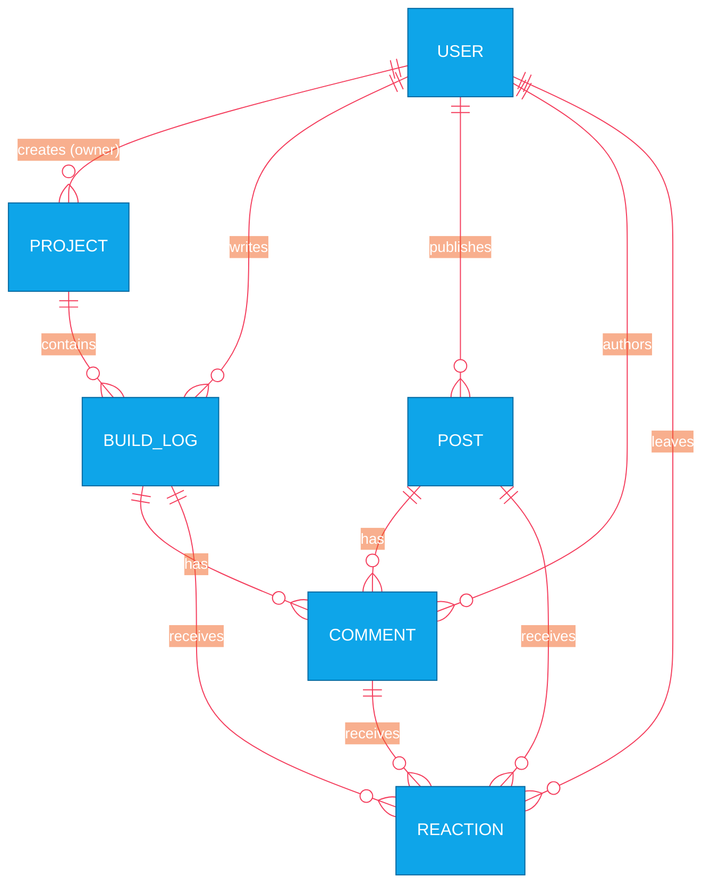

# ADR 0001: PostgreSQL over MongoDB

## Status
Accepted

## Context
I need a primary data store for DevForge. The platform relies heavily on highly relational data: users, projects, build logs, posts, comments, tags, and reactions.

## Decision
I will use **PostgreSQL** as My primary database instead of MongoDB. I will manage schema and migrations using the **Prisma ORM**.

## Consequences
- **Positive:** Guaranteed referential integrity (e.g., cascading deletes for deeply nested comments and reactions).
- **Positive:** I can leverage PostgreSQL's native `tsvector` and GIN indexing for Full Text Search, avoiding the need for an external service like Elasticsearch in V1.
- **Negative:** Schema rigidity requires formal migrations compared to MongoDB's flexibility, though Prisma mitigates much of the developer friction.

## Data Relationship Overview (Why Relational Matters)

The following diagram illustrates the heavily interconnected nature of the DevForge data model, which makes a relational database like PostgreSQL ideal for enforcing referential integrity.

