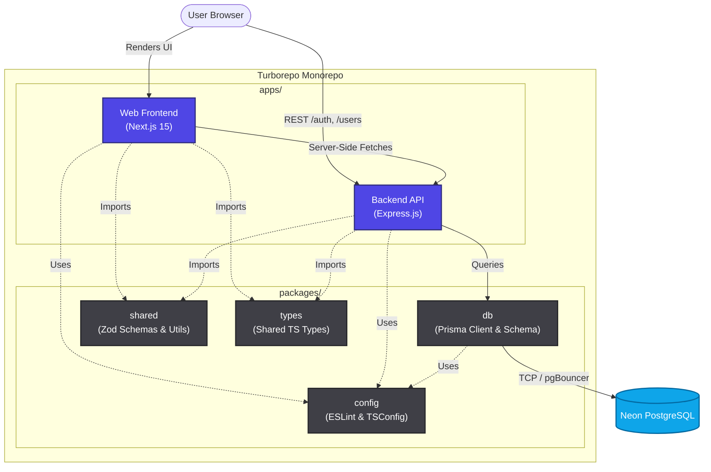

# ADR 0002: Modular Monolith

## Status
Accepted

## Context
DevForge has a wide scope (Auth, Users, Projects, Posts, Build Logs, Reactions, Notifications). I need an architectural pattern that supports this complexity without overwhelming a single developer.

## Decision
I will use a **Modular Monolith** pattern housed within an **npm workspaces + Turborepo** monorepo.
- Next.js 15 (App Router) for the frontend (`apps/web`).
- Express + Node.js for the backend API (`apps/api`).
- Shared Prisma schema and logic (`packages/db`, `packages/shared`).

## Consequences
- **Positive:** Single deployment pipeline for the backend (Railway) and frontend (Vercel).
- **Positive:** Type safety boundaries are preserved between frontend and backend via shared Zod schemas.
- **Negative:** Harder to scale individual backend processes independently, but perfectly acceptable for V1 traffic loads.

## Architecture Diagram

The following diagram illustrates the boundaries of the Modular Monolith within the Turborepo workspace. It highlights how the independent applications share business logic, types, and database access packages without requiring distributed microservices.

